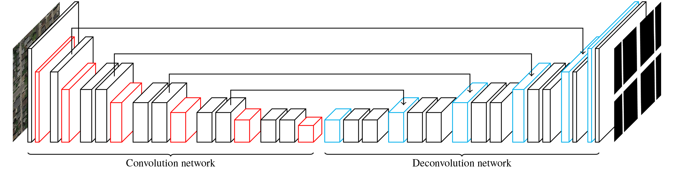
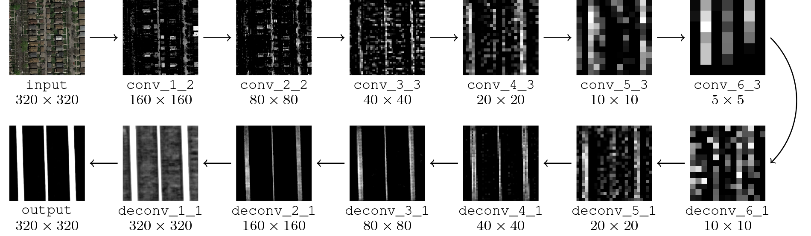
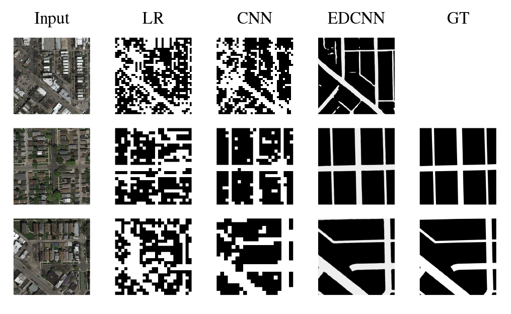

# U-Net for Road Segmentation

In this project, we are training a classifier to segment roads in aerial images from Google Maps, given a train dataset containing 100 labeled images of 400×400 pixels.  After  the  training,  we  run  a  prediction  on 50 test images of 608×608 pixels. The predicted images are then cropped  in  patches  of 16×16 pixels  and  transformed  to  a .csv submission  file  containing  the  predicted  output  (1 for a road, 0 for background) for each patch.

*An illustration of the model. Layers drawn in red are convolutional layers with stride 2, which down-sample the previous layers. Layers drawn in blue are deconvolutional layers with stride 2, which up-sample the previous layers.*
 
 

*A visualization of our segmentation models applied on three im- ages. From left to right, the images correspond to: input, logistic regression, naïve CNN, encoder-decoder CNN, ground-truth (if available).*
 

*An illustration of the intermediate layers in the network when predicting the segmentation a single aerial image. For each of the convolutional
and deconvolutional layers, we select a slice and show it as an image here.*
 

Link to the Kaggle competition: [https://www.kaggle.com/c/epfml17-segmentation](https://www.kaggle.com/c/epfml17-segmentation)

## Files
* `run.py`: trains the model and computes the predictions.
* `data_augmentation.py`: augments the training data by rotation and cropping.
* `deconvnet.py`: defines the class that describes the DeconvNet model.
* `helpers.py`: some helper functions.
* `init_archi.py`: contains all the project's paths and a function to create the directories.
* `mask_to_submission.py`: computes the .csv to submit to Kaggle from predictions in.

## Dependencies
To install the dependencies, run the command `pip install -r requirements.txt`.

## Pretrained model
To run a pretrained network, download the weights [here](https://drive.google.com/open?id=1G6pBPbPOCbg9a-GwAZZVocPqBcnWKnEj)
and place them in the folder `save_model`. Then run the command:
`python3 run.py --restore_M1=True --restore_M2=True --init_archi=True`.

## Authors
Alexandre Carlier, Félix Schaller & Yubo Xie.
